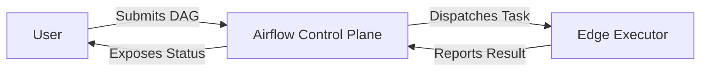
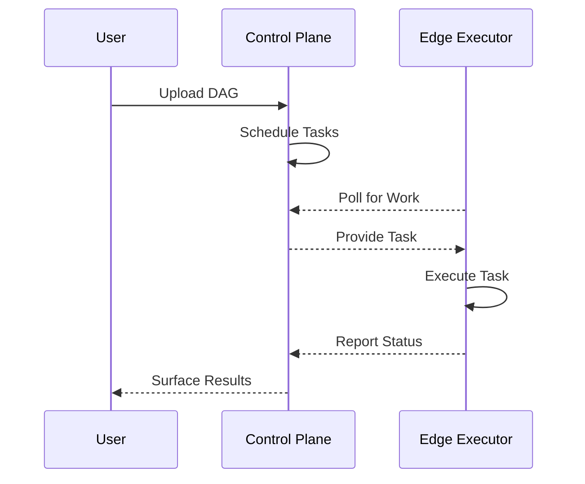

# ADR 0001: Edge Execution Architecture

## Status
Proposed

## Context
AirBridge leverages Apache Airflow 3.0.4 as a control-plane while delegating
actual task execution to lightweight edge workers. This separation enables
centralized orchestration and monitoring while allowing tasks to run close to
resources or data.

## Decision
Adopt a control-plane/edge-execution model using Airflow 3.0.4 with an
Edge Executor component. The control plane manages DAG scheduling,
versioning, and metadata, while edge nodes pull tasks and execute them
locally via the executor.

## Network Flows
1. User submits DAG definitions to the control plane.
2. Control plane schedules tasks and places work items in a queue.
3. Edge executors poll the queue, pull tasks, and execute them near data.
4. Execution results and metadata are pushed back to the control plane.
5. Control plane exposes task status and logs to users.

## Sequence of Task Execution

## Version Pinning Strategy
- Pin Airflow to 3.0.4 across control plane and edge images.
- Use container image digests to guarantee reproducible deployments.
- Maintain a compatibility matrix for executor plugins and edge runtimes.

## Risks and Mitigations
| Risk | Mitigation |
|------|------------|
| Network partitions between control plane and edge nodes | Implement exponential backoff retry and local task queuing |
| Divergent Airflow versions across components | Enforce image digest pinning and CI validation |
| Unauthorized task execution | Mutual TLS and fine-grained API tokens |
| Excessive latency for remote tasks | Allow data locality hints and executor-side caching |

## Consequences
- Enables scalable, geo-distributed execution with central oversight.
- Increases complexity in network security and version management.
- Requires robust observability to correlate control-plane and edge events.

