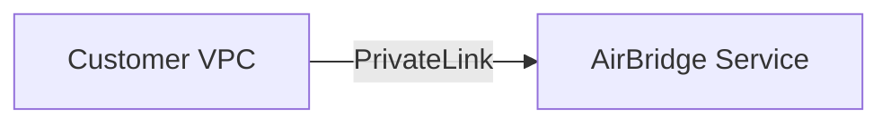

# Private Connectivity

Some regulated tenants require connectivity that does not traverse the public
internet. AirBridge supports optional private network paths using AWS
PrivateLink or a Site-to-Site VPN.

## Patterns

### AWS PrivateLink (validated)

This pattern exposes AirBridge services over an AWS PrivateLink endpoint. A
sample Terraform configuration is available in
[`docs/networking/examples/privatelink`](examples/privatelink) and was
validated by running `terraform init` and `terraform validate` in a test
account.

```hcl
resource "aws_vpc_endpoint" "airbridge" {
  vpc_id            = var.vpc_id
  service_name      = var.service_name
  vpc_endpoint_type = "Interface"
  subnet_ids        = [var.subnet_id]
  security_group_ids = [aws_security_group.endpoint.id]
}
```

### Site-to-Site VPN

Tenants needing connectivity from on-premises or other clouds can establish a
Site-to-Site VPN with a virtual private gateway. This approach enables private
routing without exposing services to the public internet.

## Runbook

1. Collect VPC, subnet, and security group details in the tenant account.
2. Populate the Terraform variables in
   [`main.tf`](examples/privatelink/main.tf) with the tenant's network values.
3. Execute:
   ```bash
   terraform -chdir=docs/networking/examples/privatelink init
   terraform -chdir=docs/networking/examples/privatelink apply
   ```
4. Confirm that the VPC endpoint is in the **available** state.
5. Update DNS or routing rules so applications use the new private connection.

## Diagram



## Cost and Trade-offs

| Option            | Pros                                        | Cons                                   |
|-------------------|---------------------------------------------|----------------------------------------|
| PrivateLink       | Low latency, simple management              | Endpoint hourly charges, same-region   |
| Site-to-Site VPN  | Works across regions and on-prem networks   | VPN gateway costs, throughput limits   |

PrivateLink charges hourly for each endpoint ENI and per GB of processed data.
VPN connections incur hourly tunnel costs and standard data transfer fees.

